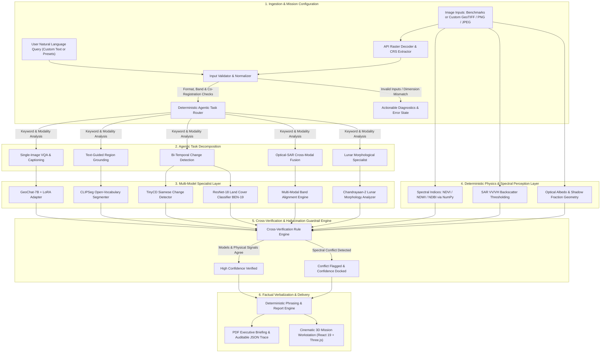

# SatQuery AI — Multimodal Vision-Language Mission Intelligence
### Smart India Hackathon (SIH 2026) · Problem Statement SIH26167
**Sponsoring Organization:** Indian Space Research Organisation (ISRO) / Space Applications Centre (SAC), Department of Space, Government of India  
**Domain:** Space Technology / AI / Remote Sensing & Planetary Science  
**Status:** Production-Ready Mission Workstation & Validated ML Pipeline

---

[](file:///c:/Users/sai%20siddhartha%20raj/SatQuery-AI/SatQuery-AI/tests)
[](file:///c:/Users/sai%20siddhartha%20raj/SatQuery-AI/SatQuery-AI/requirements.txt)
[](file:///c:/Users/sai%20siddhartha%20raj/SatQuery-AI/SatQuery-AI/app/api_server.py)
[](file:///c:/Users/sai%20siddhartha%20raj/SatQuery-AI/SatQuery-AI/frontend)
[](file:///c:/Users/sai%20siddhartha%20raj/SatQuery-AI/SatQuery-AI/LICENSE)

---

## 🛰️ Executive Summary & Problem Statement

### The Problem (SIH26167)
Modern satellite constellations (e.g., ISRO's Cartosat, RISAT, Chandrayaan, EOS-series, alongside Sentinel and Landsat) capture terabytes of multimodal Earth and planetary imagery every day. However, extracting actionable intelligence from this flood of data currently requires specialized remote sensing scientists manually operating complex GIS suites, computing band indices, and interpreting radar backscatter.

Existing Vision-Language Models (VLMs) designed for everyday internet photos fail catastrophically in Earth and planetary observation because:
1. **Hallucination of Spatial & Numerical Facts:** Generic VLMs generate fluent, plausible-sounding descriptions but invent surface areas, misidentify spectral features, and hallucinate vegetation or water bodies where none exist.
2. **Ignorance of Remote Sensing Physics:** Standard models cannot interpret non-RGB bands, multi-spectral reflectance physics (NIR, SWIR), or synthetic aperture radar (SAR) polarization physics (VV/VH backscatter double-bounce vs. specular reflection).
3. **Lack of Bi-Temporal Change Reasoning:** Generic architectures cannot perform pixel-precise bi-temporal change detection to distinguish seasonal variances from genuine urban or disaster-induced destruction.
4. **Absence of Auditable Traceability:** Mission operators and space scientists cannot trust a black-box model without a step-by-step verification trace and confidence calibration.

### The SatQuery AI Solution
**SatQuery AI** is an interactive, agentic vision-language assistant built specifically for multimodal remote sensing and planetary science. It combines fine-tuned specialized deep learning models with **deterministic physical verification engines** to provide evidence-grounded, zero-hallucination analysis through natural language text queries.

Whether analyzing Sentinel optical imagery, all-weather radar penetration from SAR, multi-decade bi-temporal urban expansion, or Chandrayaan-2 lunar crater morphology, SatQuery AI provides visual mask overlays, verified analytical facts, calibrated confidence metrics, and an auditable execution trace.

---

## 🌟 Key Innovations & Differentiators

```
                       ┌──────────────────────────────────────────────┐
                       │           SATQUERY AI CORE PARADIGM          │
                       └──────────────────────────────────────────────┘
                                              │
         ┌────────────────────────────────────┼────────────────────────────────────┐
         ▼                                    ▼                                    ▼
┌──────────────────┐               ┌───────────────────────┐             ┌────────────────────┐
│   PHYSICS-FIRST  │               │   DECOUPLED FACTUAL   │             │   DUAL-DOMAIN      │
│ CROSS-CHECKING   │               │       SYNTHESIS       │             │   INTELLIGENCE     │
├──────────────────┤               ├───────────────────────┤             ├────────────────────┤
│ Learned models   │               │ The phrasing engine   │             │ Full capability    │
│ are verified by  │               │ NEVER invents numbers │             │ for both Earth RS  │
│ deterministic    │               │ or claims; it only    │             │ and Chandrayaan-2  │
│ spectral indices │               │ verbalizes verified   │             │ Lunar surface      │
│ & radar physics. │               │ structured facts.     │             │ morphology.        │
└──────────────────┘               └───────────────────────┘             └────────────────────┘
```

1. **Deterministic Physical Cross-Verification (Hallucination Guardrail):**
   Instead of trusting a neural network's unconstrained output, SatQuery AI runs classical remote sensing algorithms (NDVI, NDWI, NDBI, SAR backscatter ratio rules) in parallel with the VLM. When a deep-learning model claims "dense water body," the system checks the Normalized Difference Water Index ($NDWI > 0.3$). If they disagree, the system **transparently flags the conflict and docks its confidence score** instead of confidently misleading the analyst.
2. **Decoupled Perception and Phrasing:**
   Our phrasing engine (Phi-3 / Llama-3.2 / deterministic reporter) never inspects raw pixels directly to count objects or guess percentages. It strictly receives validated JSON facts computed by our specialist models and deterministic pipelines, completely eliminating numerical hallucinations.
3. **Dual-Domain Intelligence (Earth & Planetary Lunar):**
   SatQuery AI supports both terrestrial satellite workflows (optical, SAR, optical-SAR fusion, bi-temporal change detection) and **Chandrayaan-2 / LROC lunar surface intelligence** (PSR cold-trap identification, asymmetric crater ejecta tracking, boulder distribution, and terraced crater wall morphology).
4. **Interactive Mission Query Console & Custom Raster Ingestion:**
   Analysts can input arbitrary free-form natural language queries or trigger contextual command presets directly above the dual-panel observation workspace (`Ctrl+Enter` shortcut, inline prompt clearing). Beyond benchmark scenes, the workstation features an enterprise drag-and-drop raster ingestion engine supporting single and paired **GeoTIFF (`.tif`, `.geotiff`), PNG, and JPEG** rasters with automated CRS coordinate decoding, spatial resolution detection, and live image normalization.
5. **Auditable Execution Trace & One-Click Report Generation:**
   Every inference run yields a complete, machine-readable JSON execution trace disclosing the selected pipeline, active specialists, parameters, and verification status. Analysts can export executive-grade Markdown and PDF mission briefing reports with a single click.
6. **Cinematic 3D Mission Workstation:**
   Built with React 19, TypeScript, Tailwind CSS, and Three.js, the standalone frontend offers a space-mission operations environment featuring multi-layered 3D WebGL visualizations of Earth and the Moon, dual-channel RGB/SAR split viewers, and real-time telemetry HUDs.

---

## 🏗️ Technical Approach & End-to-End Flowchart

The SatQuery AI pipeline executes a deterministic, fail-safe data flow from user query ingestion to final intelligence report generation:



---

## 🏛️ System Architecture

SatQuery AI is built as a clean, modular microservice architecture decoupling the deep-learning backend from the operations console:

| Component | Technology | Role & Function |
|---|---|---|
| **Mission Workstation** | React 19, TypeScript, Vite, Tailwind CSS, Lucide | Standalone mission control console with telemetry HUD, dual-raster viewers, and interactive prompt accelerators. |
| **Planetary 3D Engine** | Three.js, WebGL | Photorealistic interactive 3D globes for Earth (clouds, daymap, specular, normal) and the Moon (bump map, texture). |
| **Mission Backend** | FastAPI, Uvicorn, Pydantic | High-throughput asynchronous REST API (`/api/scenarios`, `/api/analyze`, `/api/upload`, `/api/export-pdf`, `/api/batch`). |
| **Pipeline Bridge** | Python (`app.pipeline_bridge`) | Decoupled adapter orchestrating validation, agentic routing, execution, verification, and output normalization. |
| **Perception Engines** | NumPy, SciPy, Rasterio, Tifffile | Fast physical spectral indices ($NDVI, NDWI, NDBI$), SAR decibel backscatter calculus, and lunar shadow fractions. |
| **Specialist Models** | PyTorch, Hugging Face Transformers | GeoChat-7B (quantized VQA), CLIPSeg (grounding), TinyCD (change detection), and ResNet-18 (BEN-19 classification). |
| **Reporting Engine** | FPDF2, Markdown | Automated executive intelligence PDF synthesis and full JSON execution audit traces. |

---

## ⚙️ Feasibility, Viability & Operational Engineering

| Dimension | Engineering Implementation | Operational Advantage |
|---|---|---|
| **Zero Cloud Cost & Air-Gapped Readiness** | Designed to run completely offline on a single workstation laptop without external internet or third-party paid API keys. | Completely compliant with ISRO, Indian Armed Forces, and Department of Space air-gapped security protocols. |
| **Efficient Model Footprint** | GeoChat-7B runs under 4-bit quantization requiring $<6\text{GB}$ VRAM; TinyCD, CLIPSeg, and ResNet-18 run in $<2\text{GB}$ RAM or on commodity CPUs. | Feasible on field laptops, mobile workstations, and ground stations without requiring multi-GPU server clusters. |
| **Modular Microservices Architecture** | Standalone Cinematic 3D Frontend (React 19/Vite/Three.js) communicates over clean REST contracts to the high-performance FastAPI server (`app/api_server.py`). | Pluggable architecture allows seamless drop-in of future ISRO proprietary models (e.g. RISAT-1A or Cartosat-3 foundation models). |
| **Sub-Second Deterministic Fallback** | If GPU acceleration is unavailable, classical deterministic spectral and SAR engines execute in $<50\text{ms}$ on standard x86/ARM CPUs. | High mission availability: the system never crashes or goes completely dark during a field emergency. |

---

## 🌍 Impact & Benefits to ISRO and Society

```
┌──────────────────────────────────────────────────────────────────────────────────┐
│                             STRATEGIC IMPACT DOMAINS                             │
├───────────────────────────────┬──────────────────────────────────────────────────┤
│ 🌊 Disaster Response & Relief │ Rapid optical-SAR flood and cyclone damage       │
│                               │ mapping penetrating thick monsoon cloud covers.  │
├───────────────────────────────┼──────────────────────────────────────────────────┤
│ 🌾 Agriculture & Water Security│ Accurate seasonal water index tracking, drought   │
│                               │ monitoring, and crop canopy health surveillance. │
├───────────────────────────────┼──────────────────────────────────────────────────┤
│ 🛡️ Border & Infrastructure    │ All-weather SAR detection of new settlements,     │
│   Surveillance                │ runways, and road construction in sensitive zones│
└───────────────────────────────┴──────────────────────────────────────────────────┘
```

- **For ISRO Scientists & Mission Specialists:** Democratizes remote sensing analysis across space exploration teams by allowing plain-English queries against petabyte-scale repositories.
- **For National Disaster Management (NDRF / SDMA):** Enables instantaneous flood extent delineation during severe cyclones and monsoons when optical satellites are completely blinded by cloud cover.
- **For Space Exploration (Chandrayaan & Lunar Missions):** Provides rapid pre-landing analysis of slope hazards, PSR candidate ice traps, and boulder clusters for autonomous or guided planetary navigation.

---

## 🚀 Installation & Launch Guide

### Prerequisites
- **Python 3.10+** (Python 3.11 or 3.12 recommended)
- **Node.js 18+** and npm 9+
- **Git**

### Step 1: Clone Repository & Setup Virtual Environment
```bash
# Clone the repository
git clone https://github.com/huldahtejaswinikunti-AI/SatQuery-AI.git
cd SatQuery-AI

# Create Python virtual environment
python -m venv .venv

# Activate virtual environment
# On Windows PowerShell:
.venv\Scripts\activate
# On Linux / macOS:
source .venv/bin/activate

# Install all backend requirements and editable package
pip install -r requirements.txt
pip install -e .

# Configure environment variables
cp .env.example .env
```

---

### Step 2: Running the Application

You can run SatQuery AI in either of two modes:

#### Option A: Unified Single-Port Launch (Recommended for Demos)
Build the React frontend bundle once, and FastAPI will serve both the **API and the cinematic React 3D interface on port 8000**:
```powershell
# 1. Build the React frontend
cd frontend
npm install
npm run build
cd ..

# 2. Launch the unified FastAPI server
uvicorn app.api_server:app --host 127.0.0.1 --port 8000
```
*Open your browser at **`http://localhost:8000`** to access the full Mission Workstation directly!*  
*Swagger API documentation will be live at `http://localhost:8000/docs`.*

#### Option B: Dual-Server Live Development (Hot Reloading)
Run the backend and frontend independently for live development:
```powershell
# Terminal 1: Launch FastAPI Backend
uvicorn app.api_server:app --host 127.0.0.1 --port 8000 --reload

# Terminal 2: Launch Vite React Frontend
cd frontend
npm install
npm run dev
```
*Access the development server in your browser at **`http://localhost:5173`**.*

---

### Step 3: Running the Automated Test Suite
Execute the comprehensive test suite (all 145 unit and integration tests):
```powershell
python -m pytest tests/ -q
```

---

## 🖥️ Interactive Mission Workstation Operations

### A. Natural Language Querying (Custom User Input)
The **Mission Query Console** is positioned prominently above the dual-panel visual workstation:
- **Free-Form Questions:** Enter arbitrary complex prompts (e.g., *"Locate industrial warehouse facilities and compute NDVI spectral vegetation density"* or *"Analyze crater rim morphology and detect polar shadow traps"*).
- **Contextual Command Presets:** One-click chips for Earth RS (`+ Locate Buildings`, `+ Find Water Bodies`, `+ Describe Scene`, `+ Detect Changes`, `+ Spectral Vegetation`, `+ Identify Roads`) and Chandrayaan-2 Lunar RS (`+ Find Craters`, `+ Crater Morphology`, `+ Analyze Regolith`, `+ Shadow & PSRs`, `+ Ejecta Blankets`, `+ Compare Terrains`).
- **Keyboard Accelerators:** Press `Ctrl+Enter` to dispatch queries directly to the autonomous pipeline.
- **Inline Clear:** Click `✕ Clear` to reset prompts instantly.

### B. Custom Satellite Raster Ingestion (GeoTIFF / PNG / JPEG)
- Switch the observation source mode using the tab: `[ 📤 Upload Custom Rasters ]`.
- **Drag & Drop / File Picker:** Ingest 1 raster (single scene analysis) or 2 rasters (cross-modal optical+SAR fusion or pre/post disaster bi-temporal change).
- **Automated Spatial Telemetry:** Decodes raster metadata on ingestion, detecting width, height, band count, CRS coordinate reference systems, and radiometric profile.
- **Multi-Raster Inspection:** When 2 rasters are uploaded, easily toggle between Image 1 and Image 2 in the high-resolution viewer while both are processed by the multimodal pipeline.

---

## 🌐 Production Cloud Deployment

### Frontend (Vercel)
1. Import the repository into [Vercel](https://vercel.com).
2. Set **Root Directory** to `frontend`.
3. Framework Preset: `Vite`.
4. Build Command: `npm run build`, Output Directory: `dist`.
5. Add Environment Variable:
   - `VITE_API_BASE_URL` = `https://your-backend-service.onrender.com`
6. Deploy.

### Backend (Render / Docker / Linux VPS)
1. Use the included `render.yaml` or create a new Web Service on [Render](https://render.com).
2. Build Command:
   ```bash
   pip install --no-cache-dir torch torchvision --index-url https://download.pytorch.org/whl/cpu && pip install -r requirements.txt
   ```
3. Start Command:
   ```bash
   uvicorn app.api_server:app --host 0.0.0.0 --port $PORT
   ```
4. Set Environment Variables:
   - `PYTHON_VERSION` = `3.11.9`
   - `SATQUERY_USE_MOCK_FALLBACKS` = `true` (for free-tier CPU hosting)

---

## 📚 Academic References & Literature Citations

1. **GeoChat:** Kuckreja, K., et al. (CVPR 2024). *GeoChat: Grounded Large Vision-Language Model for Remote Sensing.* Mohamed bin Zayed University of Artificial Intelligence (MBZUAI).
2. **CLIPSeg:** Lüddecke, T., & Ecker, A. (CVPR 2022). *Image Segmentation Using Text and Image Prompts.* University of Göttingen.
3. **TinyCD:** Codegoni, A., et al. (IEEE GRSL 2023). *TinyCD: A (Not So) Deep Learning Network for Change Detection in Remote Sensing.*
4. **BigEarthNet-MM:** Sumbul, G., et al. (IEEE Geoscience and Remote Sensing Magazine 2021). *BigEarthNet-MM: A Large-Scale, Multimodal, Multilabel Benchmark Archive for Remote Sensing Image Classification and Retrieval.*
5. **RSVQA:** Lobry, S., et al. (IEEE TGRS 2020). *RSVQA: Visual Question Answering for Remote Sensing Data.*
6. **LEVIR-CD:** Chen, H., & Shi, Z. (IEEE TGRS 2020). *A Spatial-Temporal Attention-Based Method and a New Dataset for Remote Sensing Image Change Detection.*
7. **Chandrayaan-2 Imaging:** Chowdhury, A. R., et al. (Current Science 2020). *Terrain Mapping Camera-2 (TMC-2) and Orbiter High Resolution Camera (OHRC) on Chandrayaan-2.* ISRO / Space Applications Centre (SAC).

---

## 📄 License & Intellectual Property

SatQuery AI is open-source under the **MIT License**.  
Pretrained models (`GeoChat-7B`, `CLIPSeg`, `TinyCD`, `ResNet-18`) and datasets (`BigEarthNet`, `RSVQA`, `LEVIR-CD`) remain subject to their respective upstream licenses (Apache 2.0, MIT, Creative Commons).

---
**SatQuery AI · SIH 2026 · Indian Space Research Organisation (ISRO) / Space Applications Centre (SAC)**
