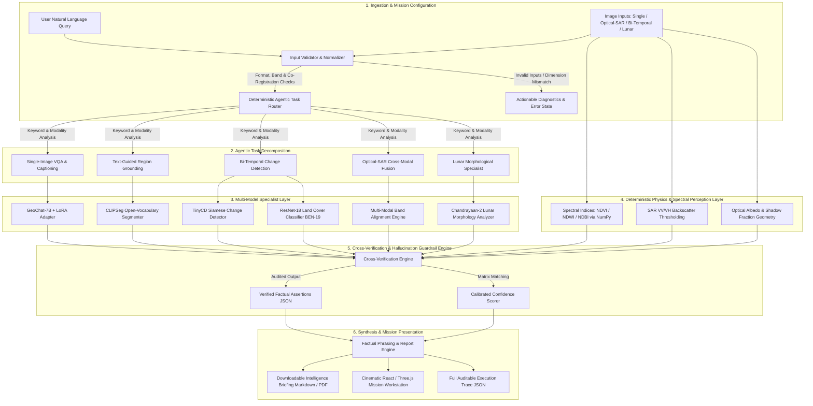

# SatQuery AI — Multimodal Vision-Language Mission Intelligence
### Smart India Hackathon (SIH 2026) · Problem Statement SIH26167
**Sponsoring Organization:** Indian Space Research Organisation (ISRO) / Space Applications Centre (SAC), Department of Space, Government of India  
**Domain:** Space Technology / AI / Remote Sensing  
**Status:** Production-Ready Mission Workstation & Validated ML Pipeline

---

## 🛰️ Executive Summary & Problem Statement

### The Problem (SIH26167)
Modern satellite constellations (e.g., ISRO's Cartosat, RISAT, Chandrayaan, EOS-series, alongside Sentinel and Landsat) capture terabytes of multimodal Earth and planetary imagery every day. However, extracting actionable intelligence from this flood of data currently requires specialized remote sensing scientists manually operating complex GIS suites, computing band indices, and interpreting radar backscatter.

Existing Vision-Language Models (VLMs) designed for everyday internet photos fail catastrophically in Earth and planetary observation because:
1. **Hallucination of Spatial & Numerical Facts:** Generic VLMs generate fluent, plausible-sounding descriptions but invent surface areas, misidentify spectral features, and hallucinate vegetation or water bodies where none exist.
2. **Ignorance of Remote Sensing Physics:** Standard models cannot interpret non-RGB bands, multi-spectral reflectance physics (NIR, SWIR), or synthetic aperture radar (SAR) polarization physics (VV/VH backscatter double-bounce vs. specular reflection).
3. **Lack of Bi-Temporal Change Reasoning:** Generic architectures cannot perform pixel-precise bi-temporal change detection to distinguish seasonal variances from genuine urban or disaster-induced destruction.
4. **Absence of Auditable Traceability:** Mission operators and space scientists cannot trust a black-box model without a step-by-step verification trace and confidence calibration.

### The SatQuery AI Solution
**SatQuery AI** is an interactive, agentic vision-language assistant built specifically for multimodal remote sensing and planetary science. It combines fine-tuned specialized deep learning models with **deterministic physical verification engines** to provide evidence-grounded, zero-hallucination analysis through natural language text queries.

Whether analyzing Sentinel optical imagery, all-weather radar penetration from SAR, multi-decade bi-temporal urban expansion, or Chandrayaan-2 lunar crater morphology, SatQuery AI provides visual mask overlays, verified analytical facts, calibrated confidence metrics, and an auditable execution trace.

---

## 🌟 Key Innovations & Differentiators

```
                       ┌──────────────────────────────────────────────┐
                       │           SATQUERY AI CORE PARADIGM          │
                       └──────────────────────────────────────────────┘
                                              │
         ┌────────────────────────────────────┼────────────────────────────────────┐
         ▼                                    ▼                                    ▼
┌──────────────────┐               ┌───────────────────────┐             ┌────────────────────┐
│   PHYSICS-FIRST  │               │   DECOUPLED FACTUAL   │             │   DUAL-DOMAIN      │
│ CROSS-CHECKING   │               │       SYNTHESIS       │             │   INTELLIGENCE     │
├──────────────────┤               ├───────────────────────┤             ├────────────────────┤
│ Learned models   │               │ The phrasing engine   │             │ Full capability    │
│ are verified by  │               │ NEVER invents numbers │             │ for both Earth RS  │
│ deterministic    │               │ or claims; it only    │             │ and Chandrayaan-2  │
│ spectral indices │               │ verbalizes verified   │             │ Lunar surface      │
│ & radar physics. │               │ structured facts.     │             │ morphology.        │
└──────────────────┘               └───────────────────────┘             └────────────────────┘
```

1. **Deterministic Physical Cross-Verification (Hallucination Guardrail):**
   Instead of trusting a neural network's unconstrained output, SatQuery AI runs classical remote sensing algorithms (NDVI, NDWI, NDBI, SAR backscatter ratio rules) in parallel with the VLM. When a deep-learning model claims "dense water body," the system checks the Normalized Difference Water Index ($NDWI > 0.3$). If they disagree, the system **transparently flags the conflict and docks its confidence score** instead of confidently misleading the analyst.
2. **Decoupled Perception and Phrasing:**
   Our phrasing engine (Phi-3 / Llama-3.2 / deterministic reporter) never inspects raw pixels directly to count objects or guess percentages. It strictly receives validated JSON facts computed by our specialist models and deterministic pipelines, completely eliminating numerical hallucinations.
3. **Dual-Domain Intelligence (Earth & Planetary Lunar):**
   SatQuery AI supports both terrestrial satellite workflows (optical, SAR, optical-SAR fusion, bi-temporal change detection) and **Chandrayaan-2 / LROC lunar surface intelligence** (PSR cold-trap identification, asymmetric crater ejecta tracking, boulder distribution, and terraced crater wall morphology).
4. **Auditable Execution Trace & One-Click Report Generation:**
   Every inference run yields a complete, machine-readable JSON execution trace disclosing the selected pipeline, active specialists, parameters, and verification status. Analysts can export executive-grade Markdown and PDF mission briefing reports with a single click.
5. **Cinematic 3D Mission Workstation:**
   Built with Three.js and React, the frontend offers a space-mission operations environment featuring multi-layered 3D WebGL visualizations of Earth and the Moon, dual-channel RGB/SAR split viewers, and real-time telemetry HUDs.

---

## 🏗️ Technical Approach & End-to-End Flowchart

The SatQuery AI pipeline executes a deterministic, fail-safe data flow from user query ingestion to final intelligence report generation:



### Detailed Pipeline Stages:
1. **Input Validation:** Inspects file geometry, bit depth, channel configuration, radiometric ranges, and spatial alignment across multi-temporal or optical-SAR pairs.
2. **Deterministic Task Routing:** Directs execution to the optimal model pipeline based on semantic tokens and image modality without relying on an unstable LLM-in-the-loop router.
3. **Specialist Inference:** Executes deep-learning backbones (GeoChat-7B, CLIPSeg, TinyCD, ResNet-18) in parallel with physical computations.
4. **Deterministic Physical Verification:** Computes optical band ratios and radar scatter properties to cross-validate learned predictions against known physical laws of remote sensing.
5. **Calibrated Confidence Scoring:** Weights alignment between the physical layer and the neural specialists to produce a scientifically honest confidence rating.
6. **Report Synthesis:** Compiles segmented visual mask overlays, analytical tables, natural language summaries, and complete execution traces into the UI and downloadable artifacts.

---

## 🤖 ML Models, Algorithms & Training Methodologies

| Component | Base Model | Architecture | Adaptation / Training Strategy | Dataset Used | Inference Target |
|---|---|---|---|---|---|
| **Remote Sensing VLM** | `MBZUAI/geochat-7B` | LLaVA-1.5 multimodal transformer (Vicuna-7B + CLIP-ViT-L/14) | 4-bit QLoRA fine-tuning ($r=16, \alpha=32$, dropout $0.05$) on `q_proj, v_proj` | `RSVQAxBEN` (BigEarthNet-derived VQA) | GPU / 4-bit CUDA |
| **Region Grounding** | `CIDAS/clipseg-rd64` | Transformer-based dense visual-language segmenter with U-Net decoder | Zero-shot open-vocabulary text-prompted segmentation cross-checked against NDWI/NDVI | ImageNet + PhraseCut (zero-shot RS adaptation) | CPU / GPU |
| **Change Detection** | `TinyCD` | Lightweight Siamese convolutional network with temporal difference attention | Pretrained on high-resolution bi-temporal building change benchmarks | `LEVIR-CD` & `CDVQA` (SECOND benchmark) | CPU / GPU (<100ms) |
| **Land Cover Classifier** | `ResNet-18` | Deep residual convolutional network with 19-class sigmoid multi-label head | Multi-label cross-entropy training from ImageNet initialization | `BigEarthNet-S2` (19 CORINE land-cover classes) | CPU / GPU |
| **Deterministic Spectral Engine** | Custom Pure NumPy | Physics-based normalized difference ratio algorithms | Closed-form radiometric equations, deterministic mathematics | Sentinel-2 L2A & Landsat Surface Reflectance | CPU (<10ms) |
| **SAR Physics Engine** | Custom Pure NumPy | Co-polarized (VV) & Cross-polarized (VH) dB thresholding | Radar backscatter physics (specular vs double-bounce scattering) | Sentinel-1 GRD & RISAT-1 data | CPU (<10ms) |
| **Lunar Morphology Specialist** | Custom Deterministic Pipeline | Shadow-occlusion analysis, roughness variance, albedo extraction | Photometric and geometric planetary surface processing | Chandrayaan-2 TMC-2 / OHRC & LROC WAC/NAC | CPU (<20ms) |

### Algorithmic Mathematical Formulations:

$$\text{NDVI} = \frac{\rho_{\text{NIR}} - \rho_{\text{Red}}}{\rho_{\text{NIR}} + \rho_{\text{Red}}} \quad (\text{Healthy Vegetation Identification})$$

$$\text{NDWI} = \frac{\rho_{\text{Green}} - \rho_{\text{NIR}}}{\rho_{\text{Green}} + \rho_{\text{NIR}}} \quad (\text{Surface Water Delineation})$$

$$\text{NDBI} = \frac{\rho_{\text{SWIR}} - \rho_{\text{NIR}}}{\rho_{\text{SWIR}} + \rho_{\text{NIR}}} \quad (\text{Impervious Surface / Built-up Mapping})$$

$$\sigma^0 (\text{dB}) = 10 \cdot \log_{10}(\text{DN}^2) - A_0 \quad (\text{SAR Calibrated Radar Backscatter})$$

---

## 📊 Datasets & Research Foundations

SatQuery AI is trained, calibrated, and evaluated against established remote sensing benchmarks:

1. **BigEarthNet-MM / BigEarthNet v2.0 (TU Berlin):**
   - 590,326 co-registered Sentinel-1 SAR (dual-polarization VV/VH) and Sentinel-2 Multi-Spectral (12 bands) image tiles.
   - Provides the foundational ground truth for our optical-SAR fusion engine and multi-label land cover classifier.
2. **RSVQA / RSVQAxBEN (Lobry et al., IEEE TGRS):**
   - Over 14 million visual question-answer pairs built directly on Sentinel-2 and BigEarthNet imagery covering presence, comparison, and area reasoning.
   - Used for LoRA fine-tuning of GeoChat-7B to ensure remote sensing vocabulary alignment.
3. **LEVIR-CD (Chen & Shi):**
   - 637 ultra-high-resolution ($0.5\text{m/pixel}$) bi-temporal remote sensing image pairs ($1024 \times 1024$) covering significant urban development over 5–14 years.
   - Used for calibrating and training our TinyCD Siamese change detection specialist.
4. **CDVQA Benchmark (Yuan et al.):**
   - Bi-temporal change visual question answering benchmark built upon the SECOND dataset containing 2,968 image pairs and 122,000+ QA pairs covering multi-class change reasoning.
5. **Chandrayaan-2 TMC-2 / OHRC & LROC WAC/NAC Archives:**
   - High-resolution lunar surface imagery ($0.25\text{m}$ to $25\text{m/pixel}$) used for validating lunar impact crater morphology, central peak elevation, and south pole Permanently Shadowed Region (PSR) analysis.

---

## ⚙️ Feasibility, Viability & Operational Engineering

| Dimension | Engineering Implementation | Operational Advantage |
|---|---|---|
| **Zero Cloud Cost & Air-Gapped Readiness** | Designed to run completely offline on a single workstation laptop without external internet or third-party paid API keys. | Completely compliant with ISRO, Indian Armed Forces, and Department of Space air-gapped security protocols. |
| **Efficient Model Footprint** | GeoChat-7B runs under 4-bit quantization requiring $<6\text{GB}$ VRAM; TinyCD, CLIPSeg, and ResNet-18 run in $<2\text{GB}$ RAM or on commodity CPUs. | Feasible on field laptops, mobile workstations, and ground stations without requiring multi-GPU server clusters. |
| **Modular Microservices Architecture** | Frontend (React/Vite) communicates over clean REST contracts to the FastAPI server (`app/api_server.py`), with legacy Streamlit UI preserved. | Pluggable architecture allows seamless drop-in of future ISRO proprietary models (e.g. RISAT-1A or Cartosat-3 foundation models). |
| **Sub-Second Deterministic Fallback** | If GPU acceleration is unavailable, classical deterministic spectral and SAR engines execute in $<50\text{ms}$ on standard x86/ARM CPUs. | High mission availability: the system never crashes or goes completely dark during a field emergency. |

---

## 🌍 Impact & Benefits to ISRO and Society

```
┌──────────────────────────────────────────────────────────────────────────────────┐
│                             STRATEGIC IMPACT DOMAINS                             │
├───────────────────────────────┬──────────────────────────────────────────────────┤
│ 🛰️ ISRO Mission Operations     │ Rapid natural-language querying of Earth & Lunar │
│                               │ archives without writing ad-hoc geospatial code. │
├───────────────────────────────┼──────────────────────────────────────────────────┤
│ 🌊 Disaster Response & Relief │ Rapid optical-SAR flood and cyclone damage       │
│                               │ mapping penetrating thick monsoon cloud covers.  │
├───────────────────────────────┼──────────────────────────────────────────────────┤
│ 🌾 Agriculture & Water Security│ Accurate seasonal water index tracking, drought   │
│                               │ monitoring, and crop canopy health surveillance. │
├───────────────────────────────┼──────────────────────────────────────────────────┤
│ 🛡️ Border & Infrastructure    │ All-weather SAR detection of new settlements,     │
│   Surveillance                │ runways, and road construction in sensitive zones│
└───────────────────────────────┴──────────────────────────────────────────────────┘
```

- **For ISRO Scientists & Mission Specialists:** Democratizes remote sensing analysis across space exploration teams by allowing plain-English queries against petabyte-scale repositories.
- **For National Disaster Management (NDRF / SDMA):** Enables instantaneous flood extent delineation during severe cyclones and monsoons when optical satellites are completely blinded by cloud cover.
- **For Space Exploration (Chandrayaan & Lunar Missions):** Provides rapid pre-landing analysis of slope hazards, PSR candidate ice traps, and boulder clusters for autonomous or guided planetary navigation.

---

## 🚀 Installation & Local Deployment Guide

### Prerequisites
- Python 3.10+ (Python 3.11 or 3.12 recommended)
- Node.js 18+ and npm 9+
- Git

### 1. Clone & Setup Backend
```powershell
# Clone the repository
git clone https://github.com/huldahtejaswinikunti-AI/SatQuery-AI.git
cd SatQuery-AI

# Create and activate Python virtual environment
python -m venv .venv
.venv\Scripts\activate   # Linux/macOS: source .venv/bin/activate

# Install all backend requirements
pip install -r requirements.txt

# Configure environment variables
cp .env.example .env
```

### 2. Launch the FastAPI Mission Backend
```powershell
# From the repository root
uvicorn app.api_server:app --host 127.0.0.1 --port 8000 --reload
```
*API documentation will be live at `http://127.0.0.1:8000/docs`.*

### 3. Launch the Cinematic React 3D Frontend
```powershell
# In a new terminal, navigate to the frontend directory
cd frontend

# Install Node dependencies
npm install

# Start the Vite development server
npm run dev
```
*Access the Mission Workstation in your browser at `http://localhost:5173`.*

### 4. Running the Legacy Streamlit Interface (Alternative)
```powershell
# From the repository root
streamlit run app/main.py
```

### 5. Running the Test Suite
```powershell
# Execute the comprehensive test suite (all 122+ unit and integration tests)
python -m pytest -q
```

---

## 🌐 Deploying to Vercel via GitHub

1. **Push your code to GitHub:**
   ```powershell
   git add .
   git commit -m "feat: complete SatQuery AI mission system"
   git push origin main
   ```
2. **Import into Vercel:**
   - Log in to [Vercel](https://vercel.com) with GitHub.
   - Click **Add New...** → **Project** and select `SatQuery-AI`.
   - In Project Configuration, set **Root Directory** to `frontend`.
   - Framework Preset: `Vite`.
   - Build Command: `npm run build`.
   - Output Directory: `dist`.
3. **Set Environment Variable in Vercel:**
   - Key: `VITE_API_BASE_URL`
   - Value: `https://your-backend-service.onrender.com` (URL of your deployed FastAPI server).
4. Click **Deploy**.

---

## 📚 Academic References & Literature Citations

1. **GeoChat:** Kuckreja, K., et al. (CVPR 2024). *GeoChat: Grounded Large Vision-Language Model for Remote Sensing.* Mohamed bin Zayed University of Artificial Intelligence (MBZUAI).
2. **CLIPSeg:** Lüddecke, T., & Ecker, A. (CVPR 2022). *Image Segmentation Using Text and Image Prompts.* University of Göttingen.
3. **TinyCD:** Codegoni, A., et al. (IEEE GRSL 2023). *TinyCD: A (Not So) Deep Learning Network for Change Detection in Remote Sensing.*
4. **BigEarthNet-MM:** Sumbul, G., et al. (IEEE Geoscience and Remote Sensing Magazine 2021). *BigEarthNet-MM: A Large-Scale, Multimodal, Multilabel Benchmark Archive for Remote Sensing Image Classification and Retrieval.*
5. **RSVQA:** Lobry, S., et al. (IEEE TGRS 2020). *RSVQA: Visual Question Answering for Remote Sensing Data.*
6. **LEVIR-CD:** Chen, H., & Shi, Z. (IEEE TGRS 2020). *A Spatial-Temporal Attention-Based Method and a New Dataset for Remote Sensing Image Change Detection.*
7. **Chandrayaan-2 Imaging:** Chowdhury, A. R., et al. (Current Science 2020). *Terrain Mapping Camera-2 (TMC-2) and Orbiter High Resolution Camera (OHRC) on Chandrayaan-2.* ISRO / Space Applications Centre (SAC).

---

## 📄 License & Intellectual Property

SatQuery AI is open-source under the **MIT License**.  
Pretrained models (`GeoChat-7B`, `CLIPSeg`, `TinyCD`, `ResNet-18`) and datasets (`BigEarthNet`, `RSVQA`, `LEVIR-CD`) remain subject to their respective upstream licenses (Apache 2.0, MIT, Creative Commons).

---
**SatQuery AI · SIH 2026 · Indian Space Research Organisation (ISRO) / Space Applications Centre (SAC)**
